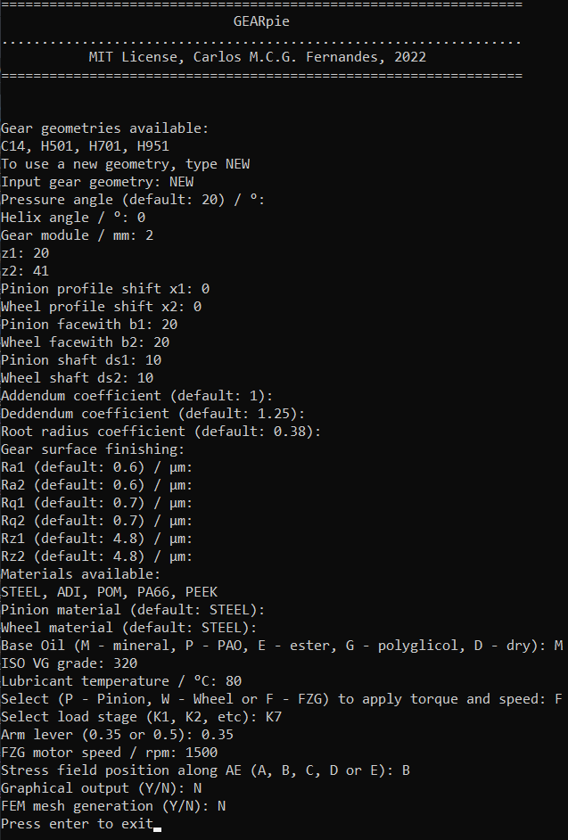
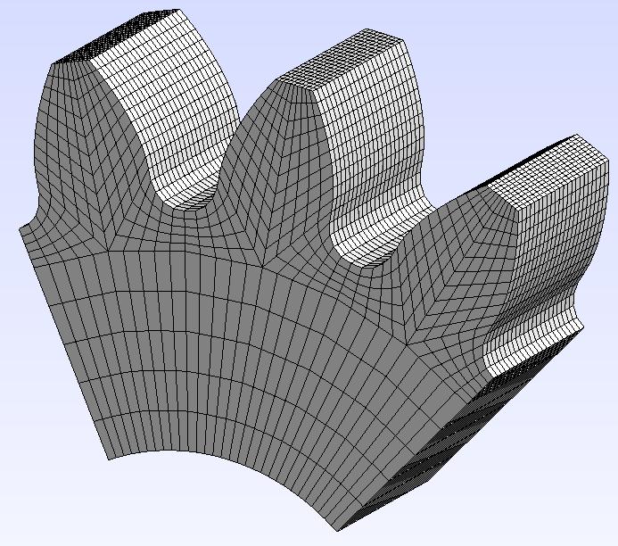
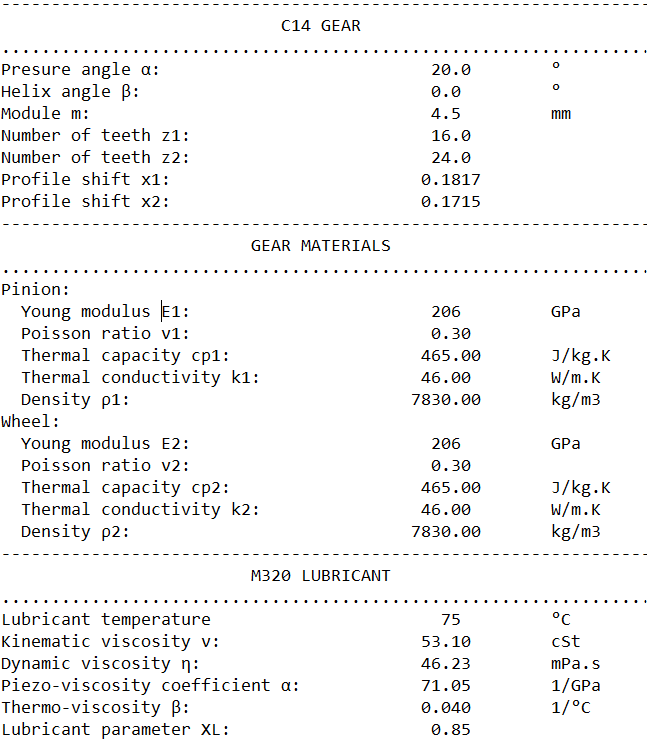
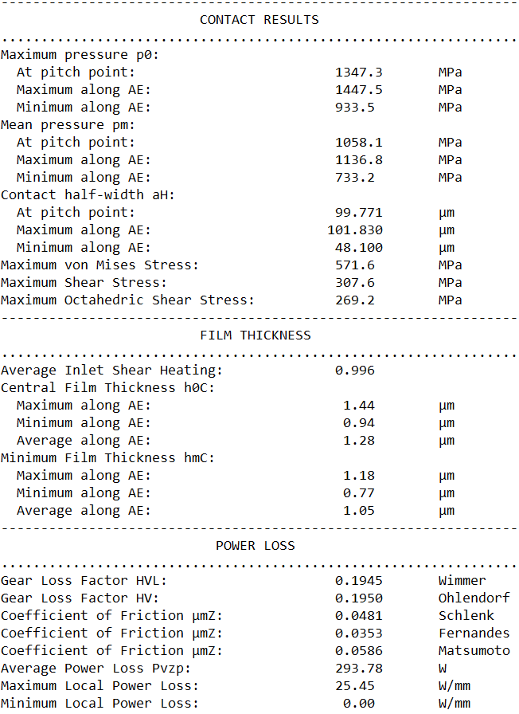

# GEARpie

## Requirements

GEARpie requires Python 3 with the following libraries:

- scipy (which includes numpy and matplotlib) -- install with "pip install scipy"
- gmsh API -- install with "pip install gmsh"

## How to use

Run 'GEARpie.py' and complete the following prompt window:

    

## Capabilities

GEARpie is useful to calculate cylindrical gears:

- geometry according to MAAG book (imposing axis distance or providing profile shifts x1 and x2)
- contact pressure and stress fields considering friction (select the position along the path of contact: A, B, C, D, E or any other)
- film thickness along the path of contact
- gear power losses (local and average)
- structured FEM mesh (1st or 2nd order elements)
- load carrying capacity according to DIN 3990 method C (steel gears)
- load carrying capacity and bulk temperature according to VDI 2736 Pat 2 (plastic gears)

The rigid load sharing model implemented on the software is descibed in [1]. If a load sharing result is provided (for example a FEM result in a text file, k=f(meshing position)) the stiffness is considered for all the calculations.

The power loss models are described in [2-5]. The Ohlendorf (analytic) and Wimmer (numerical) gear loss factors are implemented.

The mesh generation was used to create the FEM thermal model described in [8-9]. The mesh is useful for any Finite Element Analysis (tested in Abaqus and CalculiX).

## Graphical Output Example

    
    

The 3D output is not implemented by default, but is possible adding 3D entries to PLOTTING class. Every quantity calculated in CONTACT class is 3D. Central film thickness with inlet shear heating correction for an helical gear:

    

## Report Output Example

The report is automatically saved to "REPORT" folder in txt format.

 
    
    
    
    

 ## References
 
 [1] Fernandes, C. M. C. G., Marques, P. M. T., Martins, R. C., & Seabra, J. H. O. (2015). 
 Influence of gear loss factor on the power loss prediction. Mechanical Sciences, 6(2), 
 81–88. https://doi.org/10.5194/ms-6-81-2015
 
 [2] Fernandes, C. M. C. G., Martins, R. C., & Seabra, J. H. O. (2014). 
 Torque loss of type C40 FZG gears lubricated with wind turbine gear oils. 
 Tribology International, 70(0), 83–93. https://doi.org/10.1016/j.triboint.2013.10.003
 
 [3] Fernandes, C. M. C. G., Marques, P. M. T., Martins, R. C., & Seabra, J. H. O. (2015). 
 Gearbox power loss. Part I: Losses in rolling bearings. 
 Tribology International, 88(0), 298–308. https://doi.org/10.1016/j.triboint.2014.11.017
 
 [4] Fernandes, C. M. C. G., Marques, P. M. T. T., Martins, R. C., & Seabra, J. H. O. (2015). 
 Gearbox power loss. Part II: Friction losses in gears. 
 Tribology International, 88, 309–316. https://doi.org/10.1016/j.triboint.2014.12.004
 
 [5] Fernandes, C. M. C. G., Marques, P. M. T., Martins, R. C., & Seabra, J. H. O. (2015). 
 Gearbox power loss. Part III: Application to a parallel axis and a planetary gearbox. 
 Tribology International, 88, 317–326. https://doi.org/10.1016/j.triboint.2015.03.029
 
 [6] Fernandes, C. M. C. G., Martins, R. C., & Seabra, J. H. O. (2016). Coefficient of 
 friction equation for gears based on a modified Hersey parameter. Tribology International, 
 101, 204–217. https://doi.org/10.1016/j.triboint.2016.03.028
 
 [7] Fernandes, C. M. C. G. M., Hammami, M., Martins, R. C., & Seabra, J. H. O. H. (2016). 
 Power loss prediction: Application to a 2.5 MW wind turbine gearbox. 
 Proceedings of the Institution of Mechanical Engineers, Part J: Journal of Engineering Tribology, 
 230(8), 983–995. https://doi.org/10.1177/1350650115622362
 
 [8] Fernandes, C. M. C. G., Rocha, D. M. P., Martins, R. C., Magalhães, L., & Seabra, J. H. O. (2018). 
 Finite element method model to predict bulk and flash temperatures on polymer gears. 
 Tribology International, 120, 255–268. https://doi.org/10.1016/j.triboint.2017.12.027
 
 [9] Fernandes, C. M. C. G., Rocha, D. M. P., Martins, R. C., Magalhães, L., & Seabra, J. H. O. (2019). 
 Hybrid Polymer Gear Concepts to Improve Thermal Behavior. 
 Journal of Tribology, 141(3), 032201. https://doi.org/10.1115/1.4041461

Copyright (c) 2022 Carlos M.C.G. Fernandes
